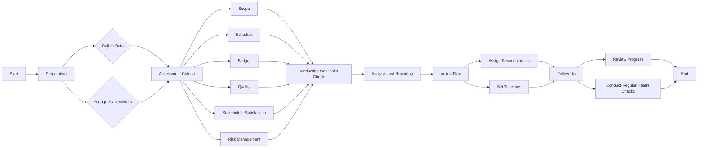

# {{ page.name }}
## {{ page.description }}

---

## Overview

The Project Health Check is a strategic tool designed to gauge the current status of a project or initiative. It encompasses a set of targeted questions and criteria that examine key project components, including scope, timeline, budget, stakeholder engagement, risk management, and team dynamics. This assessment helps in identifying areas of success and pinpointing issues that need immediate intervention.

---

## Purpose

The primary purpose of the Project Health Check is to ensure that projects are on track to meet their objectives efficiently and effectively. It serves as a proactive measure to detect potential problems early, allowing project managers to implement corrective actions swiftly. Additionally, it facilitates better communication among stakeholders by providing a clear picture of project status.

---

## Process

### Step 1: Preparation

- **Gather Data:** Collect relevant project documentation, including plans, schedules, budgets, and status reports.
- **Engage Stakeholders:** Ensure participation from key stakeholders, including team members, sponsors, and clients.

### Step 2: Assessment Criteria

- **Scope:** Is the project scope clearly defined and understood by all stakeholders?
- **Schedule:** Are the project timelines realistic, and is the project on track?
- **Budget:** Is the project within budget, and are financial resources managed effectively?
- **Quality:** Are the deliverables meeting the quality standards set at the project's outset?
- **Stakeholder Satisfaction:** Are stakeholders engaged and satisfied with the project's progress and outcomes?
- **Risk Management:** Are potential risks identified, assessed, and managed proactively?

### Step 3: Conducting the Health Check
- Utilize a questionnaire or workshop format to evaluate the project against the assessment criteria.
- Encourage open and honest feedback from all participants.

### Step 4: Analysis and Reporting
- Analyze the collected information to identify trends, issues, and areas of success.
- Prepare a Health Check Report summarizing findings, including actionable recommendations for improvement.

### Step 5: Action Plan
- Develop an action plan to address identified issues.
- Assign responsibilities and timelines for implementing the plan.

### Step 6: Follow-Up
- Schedule follow-up sessions to review the progress of the action plan.
- Conduct regular health checks to ensure continuous project improvement.

---

## Conclusion

Conducting regular Project Health Checks is vital for maintaining project alignment with its objectives and ensuring successful outcomes. By systematically assessing project components, project managers can make informed decisions, optimize resources, and enhance stakeholder satisfaction. Remember, the goal of the Health Check is not just to identify problems but to foster a culture of continuous improvement and excellence in project management.

---

## Related Resources

- [Risk Management Overview](/risk-management) - Comprehensive risk management guidance
- [Risk Assessment Matrix](/risk-management/risk-matrix) - How to evaluate and prioritise risks
- [Risk Register / RAID Log](/projects/risk_register) - Track risks and issues
- [Project Planning](/projects/project_planning) - Seven steps to successful planning
